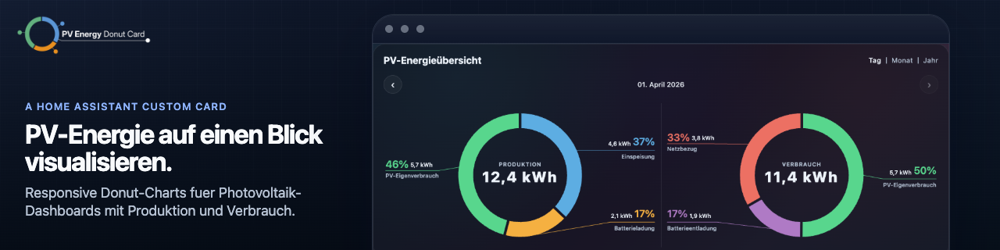


# PV Energy Donut Card

[English README](README.md)

Eine hochwertige Home-Assistant-Lovelace-Karte für Photovoltaik-Energie-Dashboards.

`pv-energy-donut-card` rendert ein oder zwei responsive Donut-Diagramme für Produktions- und Verbrauchsaufteilungen, mit großen Prozentwerten, Connector-Linien und klaren Summenwerten im Zentrum.

## Installation

### HACS

PV Energy Donut Card ist in [HACS](https://www.hacs.xyz/) (Home Assistant Community Store) verfügbar.

Mit diesem Link öffnest du das Repository direkt in HACS:

[](https://my.home-assistant.io/redirect/hacs_repository/?category=plugin&owner=pahibu&repository=pv-energy-donut-card)

1. Öffne HACS in Home Assistant.
2. Wechsle zu `Dashboard`.
3. Suche nach `PV Energy Donut Card`.
4. Installiere `PV Energy Donut Card`.
5. Aktualisiere den Browser oder starte Home Assistant bei Bedarf neu.

HACS verwaltet die Dashboard-Resource normalerweise automatisch. Falls du sie manuell hinzufügen musst, verwende:

```yaml
url: /local/community/pv-energy-donut-card/pv-energy-donut-card.js
type: module
```

### Manuelle Installation

Wenn du HACS nicht verwendest, kannst du die Karte manuell installieren.

1. Lade `pv-energy-donut-card.js` aus dem neuesten Release herunter.
2. Kopiere die Datei nach:

```text
config/www/pv-energy-donut-card/pv-energy-donut-card.js
```

3. Füge die Resource in Home Assistant hinzu:

```yaml
url: /local/pv-energy-donut-card/pv-energy-donut-card.js
type: module
```

## Features

- Home-Assistant-Lovelace-Karte für PV-Produktions- und Verbrauchs-Donuts
- ein oder zwei Donut-Diagramme pro Karte
- externe Labels mit Connector-Linien statt Legende
- Summenwerte im Zentrum mit automatischer Prozentberechnung
- `simple`- und `time_navigator`-Modus
- responsives Layout für Desktop- und Mobile-Dashboards
- Unterstützung für Home-Assistant-Sprache und Theme

## Screenshots

### Simple-Modus

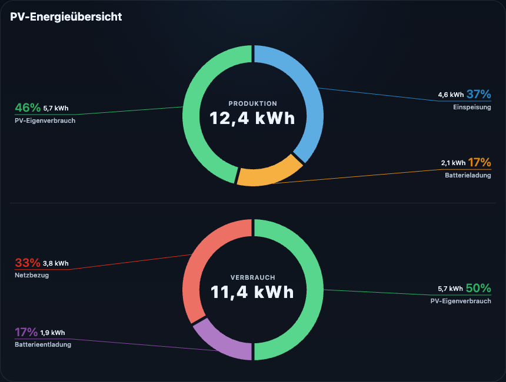

### Time Navigator

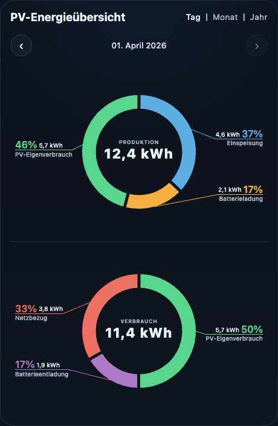

### Time Navigator nebeneinander

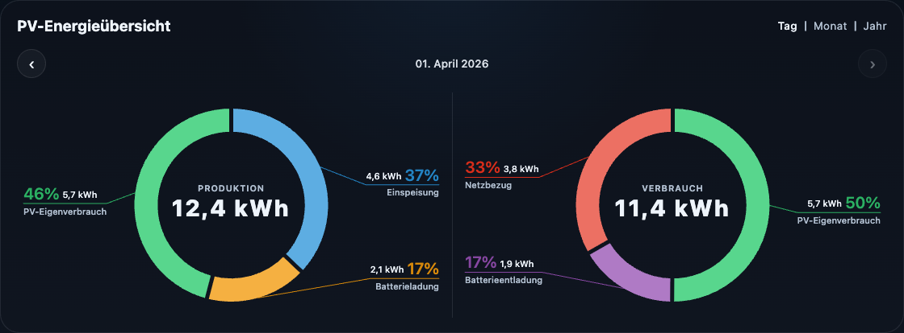

### Segmentabstand

Wähle zwischen `relaxed`, `compact` und `none`, je nachdem wie stark die Segmente optisch voneinander getrennt sein sollen.

`relaxed`


`compact`


`none`

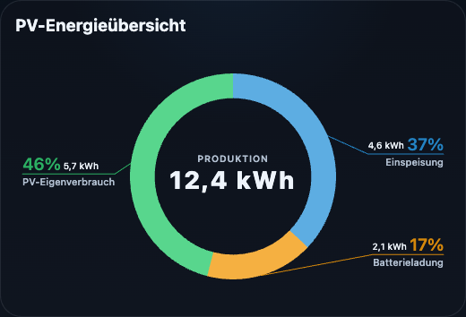

### Ringgröße

Wähle zwischen `thin`, `airy`, `balanced` und `bold`, je nachdem ob der Donut-Ring feiner, luftiger, ausgewogener oder kräftiger wirken soll.

`thin`

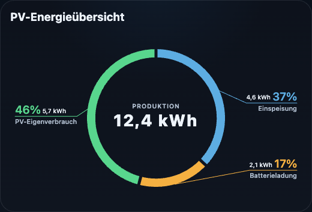

`airy`

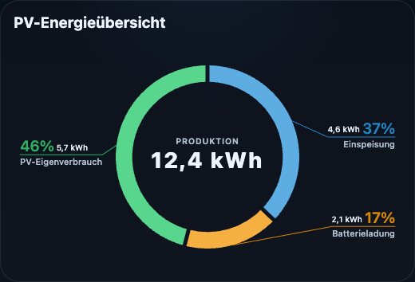

`balanced`


`bold`

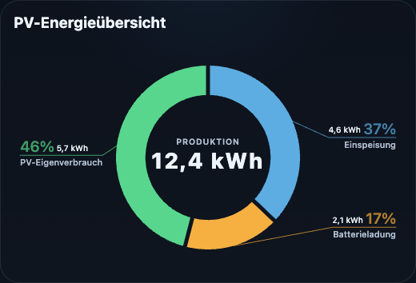

### Labelstil

Wähle zwischen `balanced`, `compact`, `minimal` und `highlight`, um die Connector-Labels ohne freie Styling-Optionen anzupassen.

`balanced`

Standarddarstellung mit klarer Prozent-Betonung.

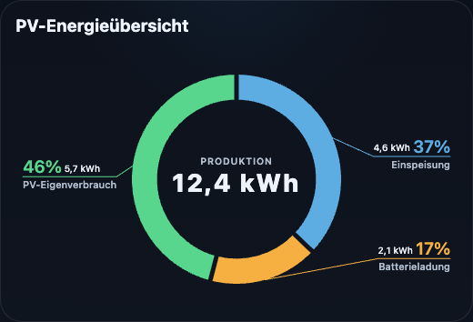

`compact`

Kompaktere Labels für schmale oder dichte Dashboards.

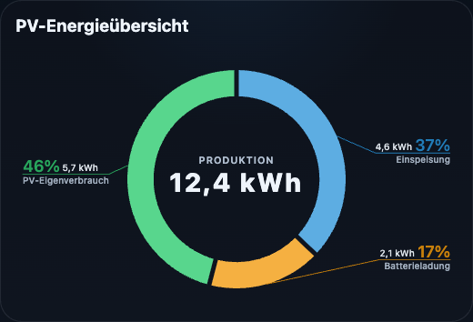

`minimal`

Ruhigere Werte und Texte für einen reduzierten Look.

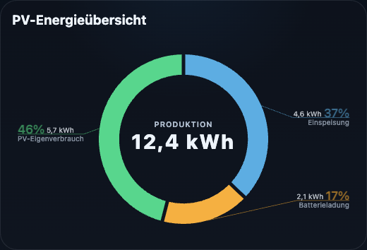

`highlight`

Stärkere Betonung von Prozent und Wert.

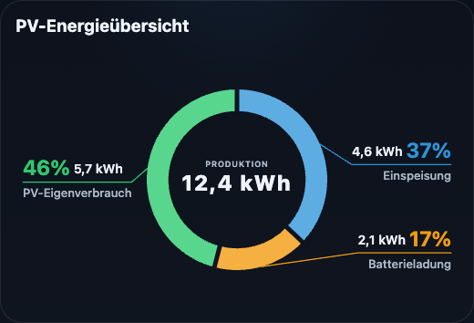

Beispiel:

```yaml
label_preset: compact
```

### Labelabstand

Wähle zwischen `wide`, `balanced` und `compact`, um zu steuern, wie weit Connector-Labels vom Donut entfernt sitzen.

`wide`

Platziert Labels nah am Kartenrand.

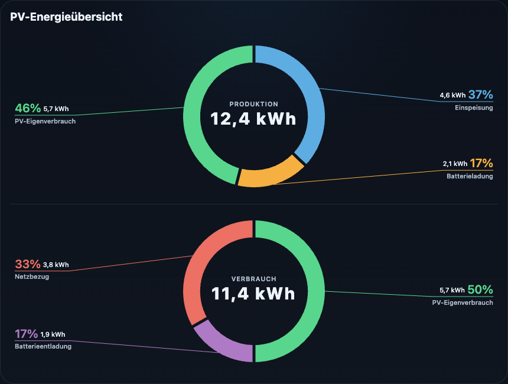

`balanced`

Standard. Begrenzt die virtuelle Labelbreite auf 600px, damit Labels auf breiten Karten nicht weiter nach außen wandern.

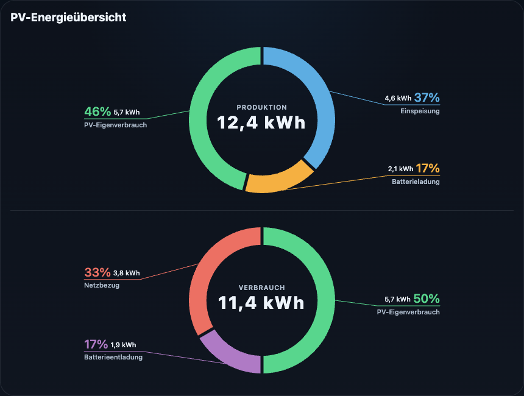

`compact`

Begrenzt die virtuelle Labelbreite auf 520px für kürzere Connector-Linien.

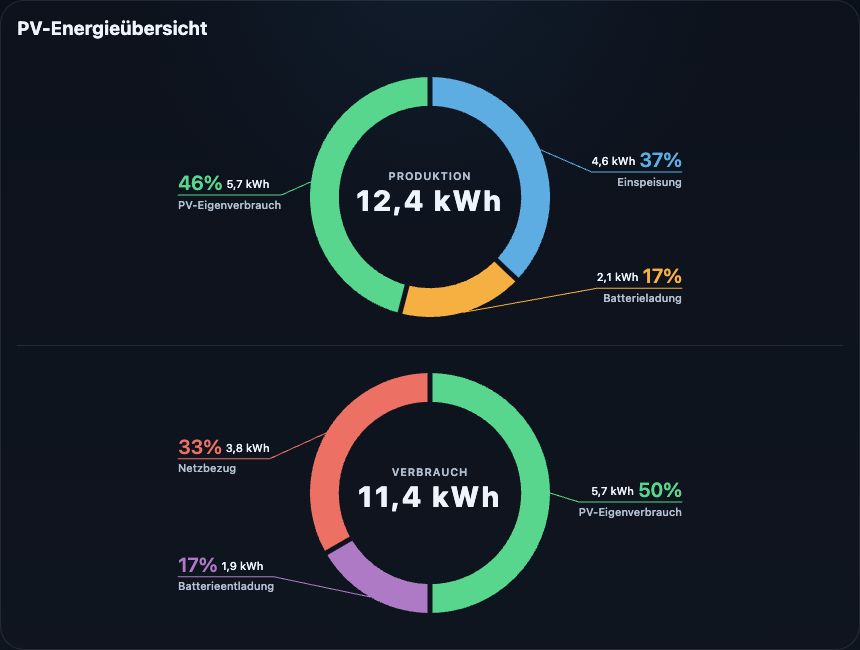

Beispiel:

```yaml
label_distance: balanced
```

## Modi

### `simple`

Verwendet direkt die aktuellen Entity-Zustände.

Geeignet für:

- aktuelle Tages-Dashboards
- Today-Sensoren wie `*_today`
- kompakte Echtzeit-Übersichten

### `time_navigator`

Fügt lokalisierte Tages-, Monats- und Jahresnavigation hinzu und lädt historische Werte aus den Recorder-Daten von Home Assistant.

Geeignet für:

- das Durchblättern früherer Tage, Monate oder Jahre
- die Kombination von kumulativen `*_total`-Sensoren mit `daily_entity`
- den Vergleich von aktuellen und historischen Zeiträumen in derselben Karte

> [!NOTE]
> Wenn `daily_entity` konfiguriert ist, wird es für den aktuellen Tag verwendet, während ältere Zeiträume aus Statistik- oder Verlaufsdaten geladen werden.

## Lovelace-Verwendung

```yaml
type: custom:pv-energy-donut-card
title: PV Energy Overview
mode: simple
ring_size: balanced
segment_spacing: relaxed
label_preset: balanced
label_distance: balanced
value_precision: 1
total_precision: 1
charts:
  - key: production
    title: Production
    unit: kWh
    segments:
      - entity: sensor.feed_in_total
        daily_entity: sensor.feed_in_today
        label: Feed-in
        color: "#5dade2"
      - entity: sensor.battery_charge_total
        daily_entity: sensor.battery_charge_today
        label: Battery charge
        color: "#f5b041"
      - entity: sensor.pv_self_use_total
        daily_entity: sensor.pv_self_use_today
        label: PV self-consumption
        color: "#58d68d"

  - key: consumption
    title: Consumption
    unit: kWh
    segments:
      - entity: sensor.pv_self_use_total
        daily_entity: sensor.pv_self_use_today
        label: PV self-consumption
        color: "#58d68d"
      - entity: sensor.battery_discharge_total
        daily_entity: sensor.battery_discharge_today
        label: Battery discharge
        color: "#af7ac5"
      - entity: sensor.grid_import_total
        daily_entity: sensor.grid_import_today
        label: Grid import
        color: "#ec7063"
```

## Konfigurationsüberblick

- `type`: muss `custom:pv-energy-donut-card` sein
- `title`: optionaler Kartentitel
- `locale`: optionale Überschreibung für Zahlenformatierung
- `mode`: `simple` oder `time_navigator`
- `ring_size`: `thin`, `airy`, `balanced` oder `bold`
- `segment_spacing`: `relaxed`, `compact` oder `none`
- `label_preset`: `balanced`, `compact`, `minimal` oder `highlight`
- `label_distance`: `wide`, `balanced` oder `compact`
- `value_precision`: Nachkommastellen für Segmentwerte
- `total_precision`: Nachkommastellen für den zentralen Summenwert
- `charts`: eine oder zwei Diagrammdefinitionen

Jedes Diagramm unterstützt:

- `key`
- `title`
- `unit`
- `no_data_text`
- `segments`

Jedes Segment unterstützt:

- `entity`
- `daily_entity`
- `label`
- `color`

Die vollständige Konfigurationsreferenz findest du in [docs/configuration.md](docs/configuration.md).

## Verhalten

- Ein konfiguriertes Diagramm nutzt die gesamte Kartenbreite.
- Zwei Diagramme werden nebeneinander dargestellt, wenn genug Platz vorhanden ist, und stapeln sich automatisch auf kleineren Layouts.
- `unknown`, `unavailable` und nicht numerische Zustände werden als `0` behandelt.
- Die Karte aktualisiert sich, wenn sich Entity-Zustände in Home Assistant ändern.
- Die sichtbaren UI-Texte folgen in Home Assistant `hass.locale.language`.
- `locale` überschreibt nur Zahlen- und Datumsformatierung, nicht die Kartensprache.
- `time_navigator` zeigt lokalisierte Tages-, Monats- und Jahres-Tabs und lädt vergangene Zeiträume aus Recorder-Daten.
- Wenn `daily_entity` konfiguriert ist, wird es für den aktuellen Tag verwendet, während ältere Zeiträume aus Verlauf oder Statistik kommen.

## Weitere Dokumentation

- [Konfigurationsreferenz](docs/configuration.md)
- [Development Notes](docs/development.md)
