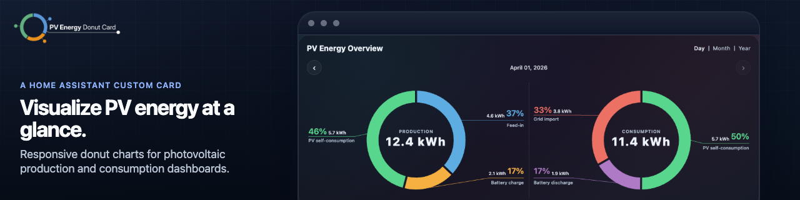
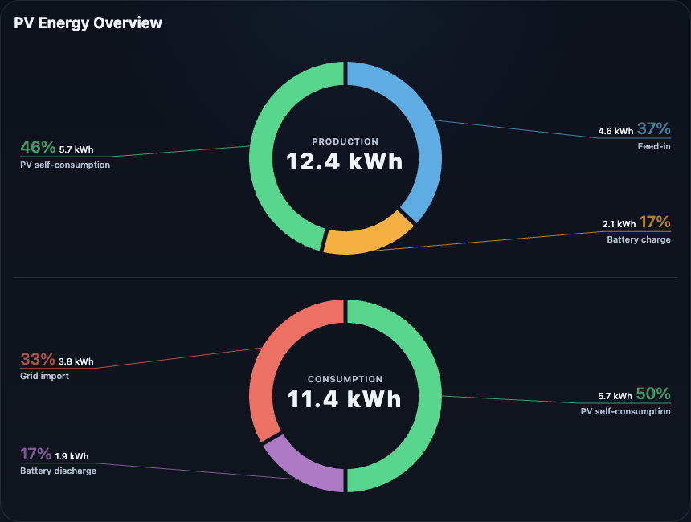
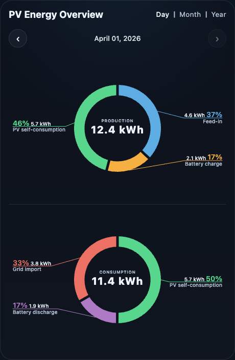
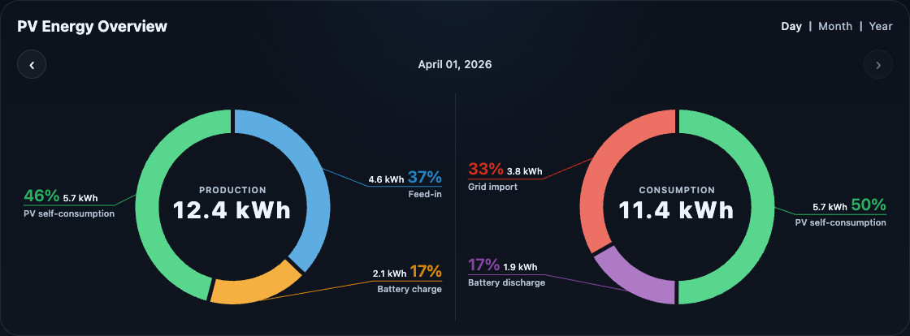
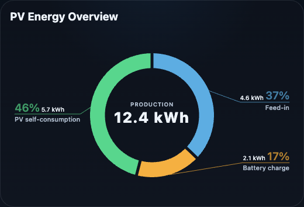
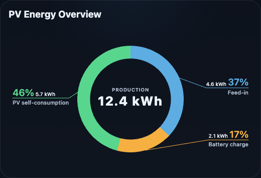
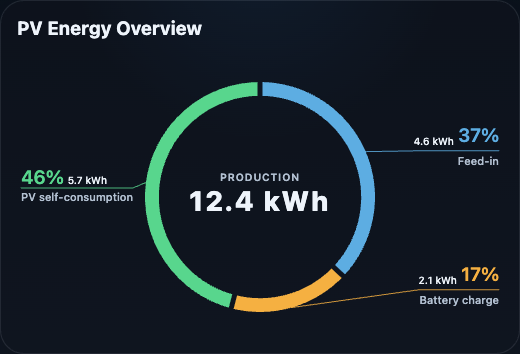
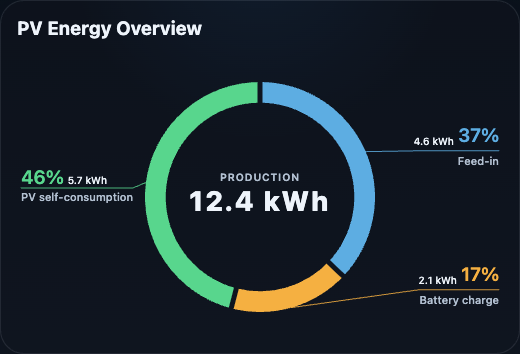
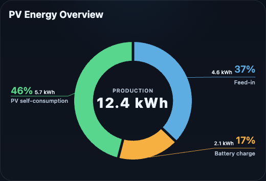

# PV Energy Donut Card

A polished Home Assistant Lovelace custom card for photovoltaic energy dashboards.

`pv-energy-donut-card` renders one or two responsive donut charts for PV production and consumption breakdowns, with large percentage callouts, connector lines, and clear center totals.

## ⚡ Features

- Home Assistant Lovelace custom card for PV production and consumption donut charts
- one or two donut charts per card
- external labels with connector lines instead of a legend
- center totals with automatic percentage calculation
- `simple` and `time_navigator` modes
- responsive layout for desktop and mobile dashboards
- Home Assistant language and theme support

## Screenshots

### Simple Mode



### Time Navigator



### Time Navigator Side-by-Side



### Segment Spacing

Choose between `relaxed`, `compact`, and `none` depending on how much separation you want between donut segments.

`relaxed`



`compact`


`none`



### Ring Size

Choose between `thin`, `airy`, `balanced`, and `bold` depending on how light or pronounced you want the donut ring to feel.

`thin`



`airy`



`balanced`


`bold`



## 🧭 Modes

### `simple`

Uses the current entity states directly.

Best for:

- current day dashboards
- today sensors such as `*_today`
- compact real-time overviews

### `time_navigator`

Adds localized day, month, and year navigation and loads historical values from Home Assistant recorder data.

Best for:

- browsing previous days, months, or years
- combining cumulative `*_total` sensors with `daily_entity`
- comparing current and historical periods in the same card

> [!NOTE]
> If `daily_entity` is configured, it is used for the current day while older periods are loaded from statistics or history data.

## 📦 Installation

### HACS custom repository

1. Open HACS in Home Assistant.
2. Go to `Frontend`.
3. Open the overflow menu and choose `Custom repositories`.
4. Add `https://github.com/pahibu/pv-energy-donut-card`.
5. Select category `Dashboard`.
6. Install `PV Energy Donut Card`.
7. Restart Home Assistant if required.

The resource is typically available at:

```yaml
url: /local/community/pv-energy-donut-card/pv-energy-donut-card.js
type: module
```

### Manual installation

1. Download `dist/pv-energy-donut-card.js` from the latest release.
2. Copy it to:

```text
config/www/pv-energy-donut-card/pv-energy-donut-card.js
```

3. Add the resource in Home Assistant:

```yaml
url: /local/pv-energy-donut-card/pv-energy-donut-card.js
type: module
```

## 🧩 Lovelace Usage

```yaml
type: custom:pv-energy-donut-card
title: PV Energy Overview
mode: simple
ring_size: balanced
segment_spacing: relaxed
value_precision: 1
total_precision: 1
charts:
  - key: production
    title: Production
    unit: kWh
    segments:
      - entity: sensor.feed_in_total
        daily_entity: sensor.feed_in_today
        label: Feed-in
        color: "#5dade2"
      - entity: sensor.battery_charge_total
        daily_entity: sensor.battery_charge_today
        label: Battery charge
        color: "#f5b041"
      - entity: sensor.pv_self_use_total
        daily_entity: sensor.pv_self_use_today
        label: PV self-consumption
        color: "#58d68d"

  - key: consumption
    title: Consumption
    unit: kWh
    segments:
      - entity: sensor.pv_self_use_total
        daily_entity: sensor.pv_self_use_today
        label: PV self-consumption
        color: "#58d68d"
      - entity: sensor.battery_discharge_total
        daily_entity: sensor.battery_discharge_today
        label: Battery discharge
        color: "#af7ac5"
      - entity: sensor.grid_import_total
        daily_entity: sensor.grid_import_today
        label: Grid import
        color: "#ec7063"
```

## ⚙️ Configuration Overview

- `type`: must be `custom:pv-energy-donut-card`
- `title`: optional card title
- `locale`: optional number formatting override
- `mode`: `simple` or `time_navigator`
- `ring_size`: `thin`, `airy`, `balanced`, or `bold`
- `segment_spacing`: `relaxed`, `compact`, or `none`
- `value_precision`: decimal places for segment values
- `total_precision`: decimal places for the center total
- `charts`: one or two chart definitions

Each chart supports:

- `key`
- `title`
- `unit`
- `no_data_text`
- `segments`

Each segment supports:

- `entity`
- `daily_entity`
- `label`
- `color`

For the full configuration reference, see [docs/configuration.md](docs/configuration.md).

## 📌 Behavior Notes

- One configured chart expands to the full card width.
- Two charts render side by side when space allows and stack automatically on smaller layouts.
- Unknown, unavailable, and non-numeric states are treated as `0`.
- The card updates when Home Assistant entity states change.
- In Home Assistant, card UI strings follow `hass.locale.language`.
- `locale` only overrides number and date formatting, not the card language.
- `time_navigator` shows localized day, month, and year tabs and loads past periods from recorder data.
- If `daily_entity` is configured, it is used for the current day while older periods come from history/statistics.

## 📚 Additional Documentation

- [Configuration reference](docs/configuration.md)
- [Development notes](docs/development.md)
