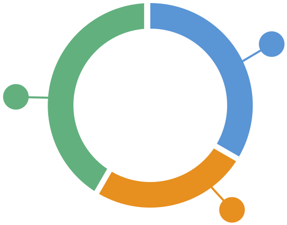
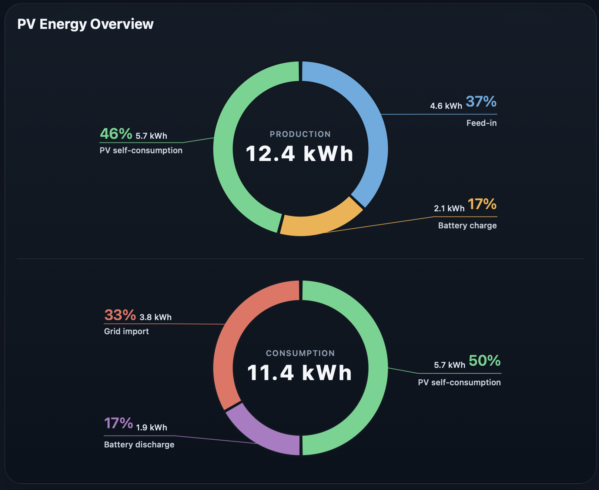
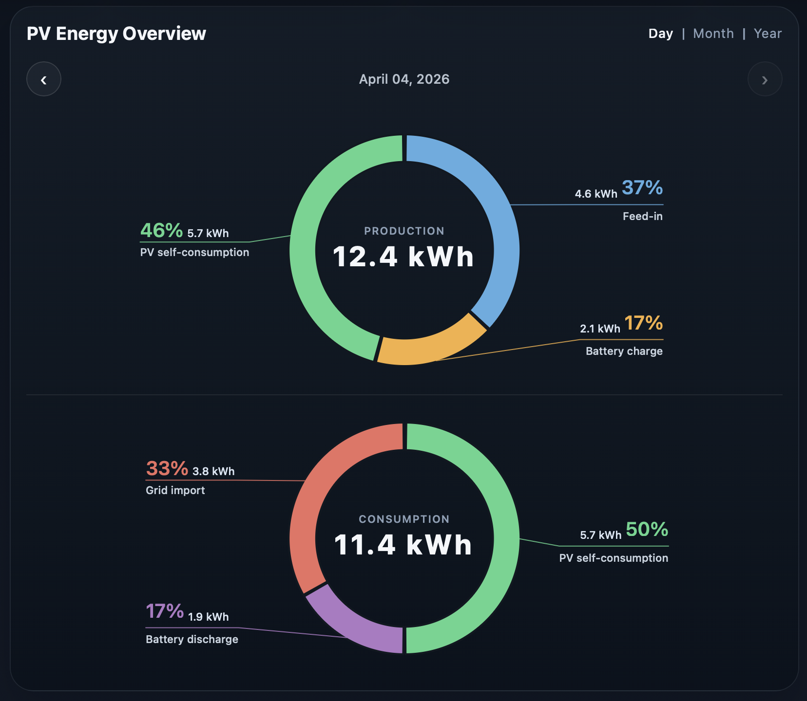
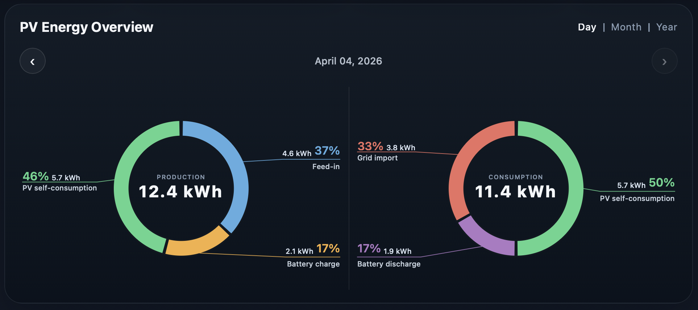

#  PV Energy Donut Card


A polished **Home Assistant Lovelace custom card** for **photovoltaic energy dashboards**.

`pv-energy-donut-card` renders one or two responsive donut charts for **PV production** and **consumption breakdowns**, with large percentage callouts, connector lines, and clear center totals optimized for dark dashboards.

It is designed for installations where you want a clean visual split of:

- feed-in
- battery charge and discharge
- PV self-consumption
- grid import

Unlike more generic chart cards, this card is focused on **energy-flow storytelling** with strong labels, compact totals, and a layout that still works well on narrow Home Assistant dashboards.

------------------------------------------------------------------------

## ⚡ Features

- Built with TypeScript, Lit, and Chart.js
- HACS-ready frontend plugin structure
- Supports one or two donut charts in a single card
- Supports `simple` and `time_navigator` modes
- Designed for PV production, self-consumption, battery, and grid flows
- External labels with connector lines instead of a cluttered legend
- Center totals with auto-calculated percentages
- Responsive layout for desktop and mobile dashboard cards
- UI text follows the active Home Assistant language, with an optional number-format locale override
- Safe fallback handling for unknown, unavailable, or non-numeric entity states
- Clean project structure for public GitHub release and future extension

------------------------------------------------------------------------

## Screenshots

### Simple Mode



### Time Navigator



### Time Navigator Side-by-Side



------------------------------------------------------------------------

## 🧭 Modes

Two operating modes are supported.

---

### `simple`

Uses the current entity states directly.

Best for:

- current day dashboards
- today sensors such as `*_today`
- compact real-time overviews

---

### `time_navigator`

Adds localized day, month, and year navigation and loads historical values from Home Assistant recorder data.

Best for:

- browsing previous days, months, or years
- combining cumulative `*_total` sensors with `daily_entity`
- comparing current and historical periods in the same card

> [!NOTE]
> If `daily_entity` is configured, it is used for the current day while older periods are loaded from statistics or history data.

## 📦 Installation

### HACS custom repository

1. Open HACS in Home Assistant.
2. Go to `Frontend`.
3. Open the overflow menu and choose `Custom repositories`.
4. Add `https://github.com/pahibu/pv-energy-donut-card`.
5. Select category `Dashboard`.
6. Install `PV Energy Donut Card`.
7. Restart Home Assistant if required.

The resource is typically available at:

```yaml
url: /local/community/pv-energy-donut-card/pv-energy-donut-card.js
type: module
```

### Manual installation

1. Download `dist/pv-energy-donut-card.js` from the latest release.
2. Copy it to:

```text
config/www/pv-energy-donut-card/pv-energy-donut-card.js
```

3. Add the resource in Home Assistant:

```yaml
url: /local/pv-energy-donut-card/pv-energy-donut-card.js
type: module
```

------------------------------------------------------------------------

## 🧩 Lovelace Usage

```yaml
type: custom:pv-energy-donut-card
title: PV Energy Overview
mode: simple
value_precision: 1
total_precision: 1
charts:
  - key: production
    title: Production
    unit: kWh
    segments:
      - entity: sensor.feed_in_total
        daily_entity: sensor.feed_in_today
        label: Feed-in
        color: "#5dade2"
      - entity: sensor.battery_charge_total
        daily_entity: sensor.battery_charge_today
        label: Battery charge
        color: "#f5b041"
      - entity: sensor.pv_self_use_total
        daily_entity: sensor.pv_self_use_today
        label: PV self-consumption
        color: "#58d68d"

  - key: consumption
    title: Consumption
    unit: kWh
    segments:
      - entity: sensor.pv_self_use_total
        daily_entity: sensor.pv_self_use_today
        label: PV self-consumption
        color: "#58d68d"
      - entity: sensor.battery_discharge_total
        daily_entity: sensor.battery_discharge_today
        label: Battery discharge
        color: "#af7ac5"
      - entity: sensor.grid_import_total
        daily_entity: sensor.grid_import_today
        label: Grid import
        color: "#ec7063"
```

------------------------------------------------------------------------

## ⚙️ Configuration

### Card options

| Name | Type | Required | Default | Description |
| --- | --- | --- | --- | --- |
| `type` | string | yes |  | Must be `custom:pv-energy-donut-card` |
| `title` | string | no |  | Optional card title |
| `locale` | string | no | HA locale | Overrides number formatting locale |
| `mode` | string | no | `simple` | `simple` uses current entity states, `time_navigator` adds day/month/year navigation |
| `value_precision` | number | no | `1` | Decimal places for segment values |
| `total_precision` | number | no | `1` | Decimal places for center total |
| `charts` | array | yes |  | One or two chart definitions |

### Chart options

| Name | Type | Required | Default | Description |
| --- | --- | --- | --- | --- |
| `key` | string | no | derived | Stable chart key |
| `title` | string | no | `Chart 1` / `Chart 2` | Center title text |
| `unit` | string | no | `kWh` | Unit shown in labels and totals |
| `no_data_text` | string | no | `No numeric energy data available` | Fallback when all values are zero |
| `segments` | array | yes |  | Segment list |

### Segment options

| Name | Type | Required | Default | Description |
| --- | --- | --- | --- | --- |
| `entity` | string | yes |  | Home Assistant entity providing an energy value |
| `daily_entity` | string | no |  | Optional day sensor used for the current day instead of the cumulative entity |
| `label` | string | no | derived | Display label |
| `color` | string | no | palette | Arc, connector, and percentage color |

------------------------------------------------------------------------

## 🏠 Main Use Cases

### Production breakdown

Use the first donut to split total PV production into:

- Feed-in
- Battery charge
- PV self-consumption

### Consumption or self-consumption breakdown

Use the second donut to show how consumption is covered by:

- PV self-consumption
- Battery discharge
- Grid import

Percentages are calculated automatically from the current energy values reported by your entities.

------------------------------------------------------------------------

## 📌 Behavior Notes

- One configured chart expands to the full card width.
- Two charts render side by side when space allows and stack automatically on smaller layouts.
- Unknown, unavailable, and non-numeric states are treated as `0`.
- The card updates when Home Assistant entity states change.
- In Home Assistant, card UI strings follow `hass.locale.language`.
- `locale` only overrides number and date formatting, not the card language.
- `time_navigator` shows localized day, month, and year tabs and loads past periods from recorder data.
- If `daily_entity` is configured, it is used for the current day while older periods come from history/statistics.
- Chart.js instances are reused to avoid unnecessary redraw churn.

------------------------------------------------------------------------

## ❤️ Developer Notes

- Keep source code, config keys, comments, and technical documentation in English.
- Keep visible card and preview UI strings translatable through the shared i18n layer.
- In Home Assistant, use `hass.locale.language` for UI language selection.
- Use `locale` only for number and date formatting overrides.
- Add new languages in the shared translation module before wiring them into the preview switcher.
- Keep connector and hover label text readable in both light and dark Home Assistant themes.
- After changing rendering or theme-sensitive styles, verify hover/active states in both theme modes.
- Run `npm test` after changes that affect rendering, formatting, or data handling.
- Rebuild `dist/pv-energy-donut-card.js` before publishing or opening a release PR.

------------------------------------------------------------------------

### Run locally

```bash
npm install
npm run build
```

For watch mode during development:

```bash
npm run dev
```

For type-checking:

```bash
npm run lint
```

For tests:

```bash
npm test
```

The production bundle is generated at:

```text
dist/pv-energy-donut-card.js
```

### Preview with dummy data

You can test the card locally without Home Assistant:

```bash
npm run preview
```

Then open:

```text
http://localhost:4173/
```

The preview page loads the built card bundle and injects mock Home Assistant entity states so you can validate the donut rendering and label layout in isolation.

The preview includes a flag-based language switcher for German and English. It changes the simulated Home Assistant language so you can verify localized UI copy before adding more languages such as Spanish.

It also includes a light and dark mode switch with sun and moon toggles so you can quickly validate both visual themes.

For a dynamic local workflow with automatic rebuilds and browser reloads, run these in two terminals:

```bash
npm run dev
```

```bash
npm run dev:preview
```

Then open:

```text
http://127.0.0.1:4173/
```

The center label sizing still adapts automatically on resize, but you can tune it with CSS variables if you want smaller or larger text:

```yaml
card_mod:
  style: |
    :host {
      --pv-center-title-scale: 0.9;
      --pv-center-total-scale: 0.85;
      --pv-center-total-min: 12;
      --pv-center-total-max: 28;
      --pv-label-percent-scale: 0.95;
      --pv-label-value-scale: 0.9;
      --pv-label-text-scale: 0.92;
      --pv-label-line-width: 2;
    }
```

------------------------------------------------------------------------

## 🚀 Roadmap

- More layout tuning options
- Optional empty-state ring rendering
- Additional label formatting controls

------------------------------------------------------------------------

## License

MIT
